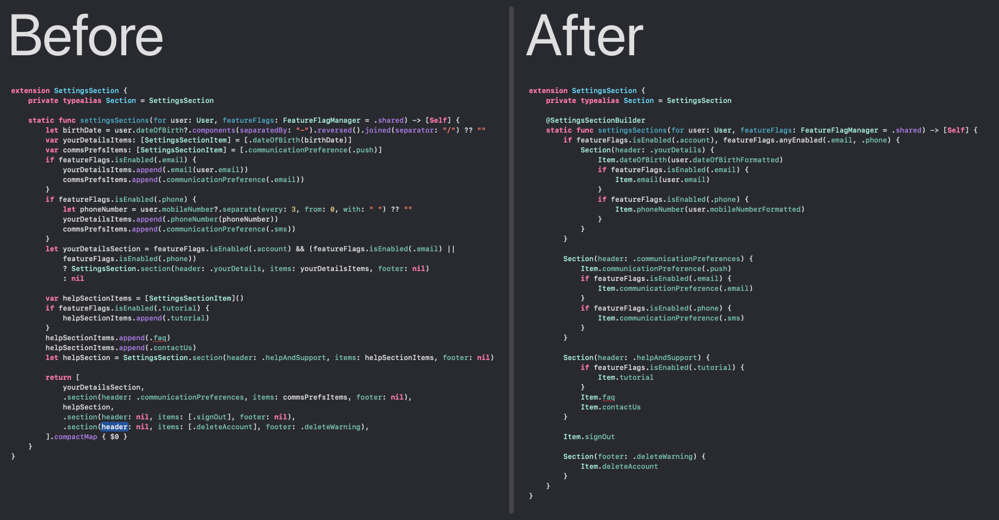
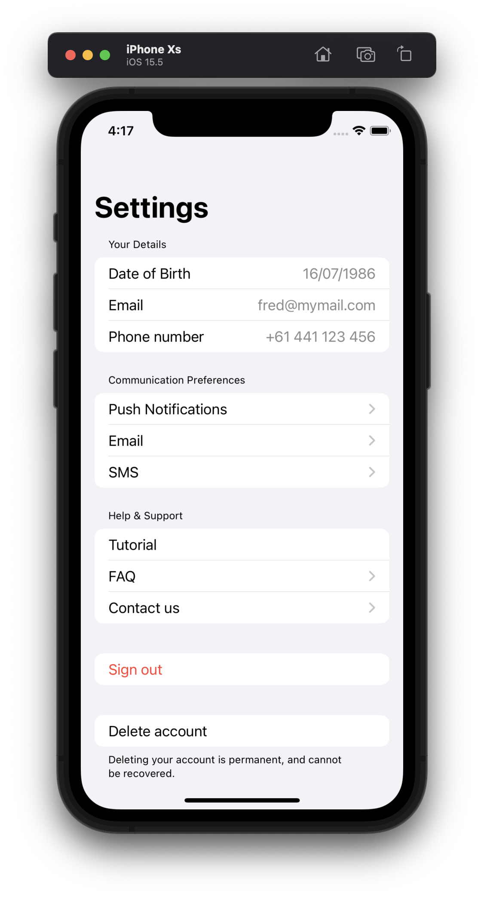

# Swift Result Builders

This is a project to demonstrate how correct usage of Result Builders can lead to cleaner and easier to maintain code.

The below image shows where the code started with very common patterns of intermediate arrays to achieve conditional sections (left) and how the code now looks with the addition of a result builder (right).

In both of the above scenarios the app looks like this:

